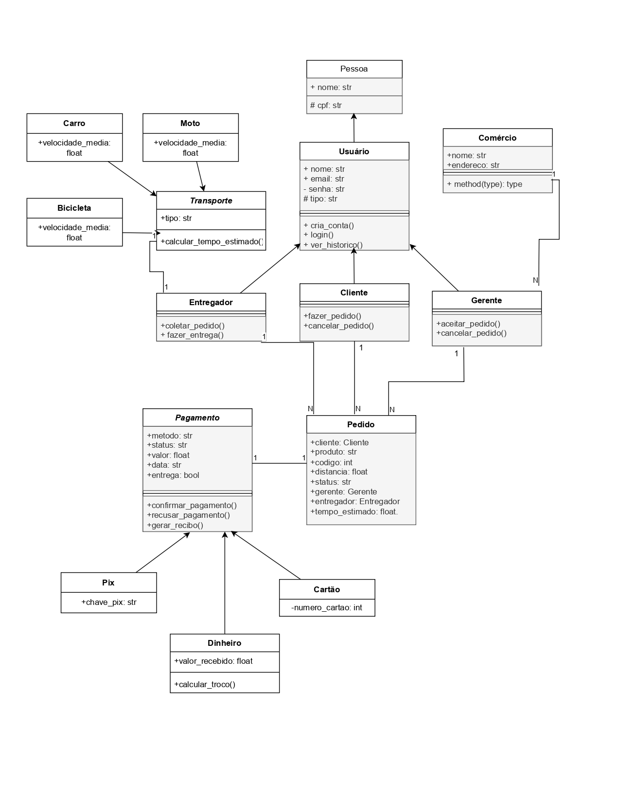

# 🚀 SpeedBox

Delivery system with order management, developed with object-oriented structure.

## Index

- [About](#about)

- [Class Diagram](#class-diagram)

- [Features](#features)

- [Technologies](#technologies)

- [Installation](#installation)

- [How to Use](#how-to-use)

## 📑 About

SpeedBox is a Python-based delivery management system, using OOP with inheritance, encapsulation, and class association. It uses JSON files for data persistence and the bcrypt library for secure authentication via password hashing.  
The system manages orders with unique codes, supports multiple payment methods, and offers flexibility for different types of transport, ensuring scalability and security for operations.

## 📌 Class Diagram

## ✔️ Features

- Customer registration  
- Delivery estimation  
- Order management  
- History visualization  
- Login with authentication for multiple profiles  

## 💻 Technologies

- Python  
- JSON  
- bcrypt  

## 🧪 How to Use

1. Download dependencies:  
Install the `bcrypt` library:

    pip install bcrypt

2. Clone the repository:  
Clone the project and access the folder:

    git clone https://github.com/raffaela09/SpeedBox---TADS2.git
    cd SpeedBox--TADS2

3. Run the application:  
Execute the `main_menu.py` file with Python:

    python main_menu.py
